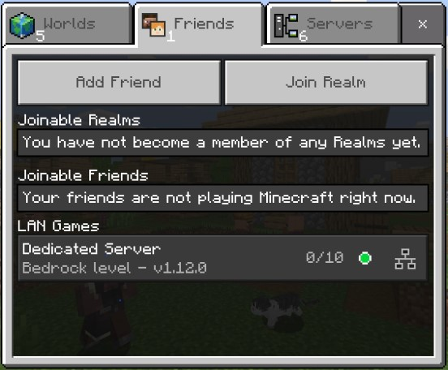

# 基岩版

## 快速开始

以下命令启动一个运行默认版本的Bedrock专用服务器，并暴露默认的UDP端口：

```bash
docker run -d -it -e EULA=TRUE -p 19132:19132/udp -v mc-bedrock-data:/data itzg/minecraft-bedrock-server
```

> **注意**：如果你计划长时间运行服务器，强烈建议使用[Docker Compose](#deploying-with-docker-compose)或[Kubernetes](#deploying-with-kubernetes)等管理层，以便进行增量重新配置和镜像升级。

## 升级到最新的Bedrock服务器版本

当`VERSION`变量设置为"LATEST"（默认值）时，可以通过重启容器来升级Bedrock服务器。每次启动时，容器都会检查最新版本并进行升级（如果需要）。

可以通过将`VERSION`设置为"PREVIEW"来请求最新的预览版本。

## 环境变量

### 容器特定

- `EULA`（无默认值）：必须设置为`TRUE`以接受[Minecraft最终用户许可协议](https://minecraft.net/terms)
- `VERSION`（默认值为`LATEST`）：可以设置为特定服务器版本，或使用以下特殊值：
  - `LATEST`：确定最新（非预览）版本，并可在容器启动时自动升级
  - `PREVIEW`：确定最新预览版本，并会自动升级
  - 否则可以提供任何特定服务器版本。如果是预览版本，还需将`PREVIEW`设置为"true"
- `UID`（默认值从`/data`所有者派生）：可以设置为特定用户ID以运行Bedrock服务器进程
- `GID`（默认值从`/data`所有者派生）：可以设置为特定组ID以运行Bedrock服务器进程
- `TZ`（无默认值）：可以设置为特定时区，如`America/New_York`。这将设置Docker容器的时区及其日志。此外，如果你想与主机同步时间，可以将主机的`/etc/localtime`文件挂载到容器中，如`/etc/localtime:/etc/localtime:ro`。
- `PACKAGE_BACKUP_KEEP`（`2`）：保留多少个包备份

### 服务器属性

以下环境变量将设置`server.properties`中的等效属性，每个属性[在此处描述](https://minecraft.wiki/w/Server.properties#Option_keys)。
通常，每个属性通过其UPPER_SNAKE_CASE等效项进行配置。

- `SERVER_NAME`
- `GAMEMODE`
- `FORCE_GAMEMODE`
- `DIFFICULTY`
- `ALLOW_CHEATS`
- `MAX_PLAYERS`
- `ONLINE_MODE`
- `WHITE_LIST`
- `ALLOW_LIST`
- `SERVER_PORT`
- `SERVER_PORT_V6`
- `ENABLE_LAN_VISIBILITY`
- `VIEW_DISTANCE`
- `TICK_DISTANCE`
- `PLAYER_IDLE_TIMEOUT`
- `MAX_THREADS`
- `LEVEL_NAME`
- `LEVEL_SEED`
- `LEVEL_TYPE`
- `DEFAULT_PLAYER_PERMISSION_LEVEL`
- `TEXTUREPACK_REQUIRED`
- `CONTENT_LOG_FILE_ENABLED`
- `CONTENT_LOG_LEVEL`
- `CONTENT_LOG_CONSOLE_OUTPUT_ENABLED`
- `COMPRESSION_THRESHOLD`
- `COMPRESSION_ALGORITHM`
- `SERVER_AUTHORITATIVE_MOVEMENT`
- `PLAYER_POSITION_ACCEPTANCE_THRESHOLD`
- `PLAYER_MOVEMENT_SCORE_THRESHOLD`
- `PLAYER_MOVEMENT_ACTION_DIRECTION_THRESHOLD`
- `PLAYER_MOVEMENT_DISTANCE_THRESHOLD`
- `PLAYER_MOVEMENT_DURATION_THRESHOLD_IN_MS`
- `CORRECT_PLAYER_MOVEMENT`
- `SERVER_AUTHORITATIVE_BLOCK_BREAKING`
- `SERVER_AUTHORITATIVE_BLOCK_BREAKING_PICK_RANGE_SCALAR`
- `CHAT_RESTRICTION`
- `DISABLE_PLAYER_INTERACTION`
- `CLIENT_SIDE_CHUNK_GENERATION_ENABLED`
- `BLOCK_NETWORK_IDS_ARE_HASHES`
- `DISABLE_PERSONA`
- `DISABLE_CUSTOM_SKINS`
- `SERVER_BUILD_RADIUS_RATIO`
- `ALLOW_OUTBOUND_SCRIPT_DEBUGGING`
- `ALLOW_INBOUND_SCRIPT_DEBUGGING`
- `FORCE_INBOUND_DEBUG_PORT`
- `SCRIPT_DEBUGGER_AUTO_ATTACH`
- `SCRIPT_DEBUGGER_AUTO_ATTACH_CONNECT_ADDRESS`
- `SCRIPT_WATCHDOG_ENABLE`
- `SCRIPT_WATCHDOG_ENABLE_EXCEPTION_HANDLING`
- `SCRIPT_WATCHDOG_ENABLE_SHUTDOWN`
- `SCRIPT_WATCHDOG_HANG_EXCEPTION`
- `SCRIPT_WATCHDOG_HANG_THRESHOLD`
- `SCRIPT_WATCHDOG_SPIKE_THRESHOLD`
- `SCRIPT_WATCHDOG_SLOW_THRESHOLD`
- `SCRIPT_WATCHDOG_MEMORY_WARNING`
- `SCRIPT_WATCHDOG_MEMORY_LIMIT`
- `OP_PERMISSION_LEVEL`
- `EMIT_SERVER_TELEMETRY`
- `MSA_GAMERTAGS_ONLY`
- `ITEM_TRANSACTION_LOGGING_ENABLED`

例如，要配置一个平坦的、创造模式的服务器而不是默认设置，可以使用以下命令：

```bash
docker run -d -it --name bds-flat-creative \
  -e EULA=TRUE -e LEVEL_TYPE=flat -e GAMEMODE=creative \
  -p 19132:19132/udp itzg/minecraft-bedrock-server
```

## 暴露的端口

- **UDP** 19132 : 由 `SERVER_PORT` 设置的基岩服务器的 IPv4 端口。默认情况下不暴露 IPv6 端口。
  **注意** 在暴露端口时，必须附加 `/udp`，例如 `-p 19132:19132/udp`，并且必须在主机上启用 IPv4 和 IPv6。

## 卷

- `/data` : 下载的服务器扩展和运行的位置。还包含配置属性文件 `server.properties`。

你可以创建一个 `命名卷` 并像这样使用它：

```shell
docker volume create mc-volume
docker run -d -it --name mc-server -e EULA=TRUE -p 19132:19132/udp -v mc-volume:/data itzg/minecraft-bedrock-server
```

如果你使用命名卷并且希望 bedrock 进程以非 root 用户运行，那么你需要预先创建卷并将它 `chown` 到所需的用户。

例如，如果你想让 bedrock 服务器以用户 ID 1000 和组 ID 1000 运行，那么可以使用以下命令创建并 chown 名为 "bedrock" 的卷：

```shell
docker run --rm -v bedrock:/data alpine chown 1000:1000 /data
```

如果使用 `docker run`，只需在 `-v` 参数中引用该卷 "bedrock"。如果使用 compose 文件，则将卷声明为外部卷，使用以下类型的声明：

```yaml
volumes:
  bedrock:
    external:
      name: bedrock
```

## 连接

在局域网中运行容器时，你可以在 "朋友" 标签的 "局域网游戏" 部分找到并连接到专用服务器，例如：



## 权限

基岩专用服务器需要使用 XUID 定义权限。有多种工具可以在线查找这些信息，当玩家加入时也会打印到日志中。有 3 个权限级别和 3 个选项来配置每个组：

- `OPS` 用于定义服务器上的操作员。
```shell
-e OPS="1234567890,0987654321"
```
- `MEMBERS` 用于定义服务器上的成员。
```shell
-e MEMBERS="1234567890,0987654321"
```
- `VISITORS` 用于定义服务器上的访客。
```shell
-e VISITORS="1234567890,0987654321"
```

## 白名单

有两种处理白名单的方法：

第一种是将 `ALLOW_LIST` 环境变量设置为 true，并映射一个自定义的 [allowlist.json](https://minecraft.wiki/w/Whitelist.json) 文件（以前称为 "whitelist.json"）到容器中。

另一种是将 `ALLOW_LIST_USERS` 环境变量设置为逗号分隔的玩家标签用户名及其对应的 XUID。每个用户名后面应跟随其 XUID，用冒号分隔。服务器将使用这些详细信息来匹配玩家。

有多种工具可以在线查找 XUID，当玩家加入服务器时也会打印到日志中。

```shell
-e ALLOW_LIST_USERS="player1:1234567890,player2:0987654321"
```

## 模组和附加组件

也称为行为或资源包，为了向服务器添加模组，你可以按照以下步骤操作，这些步骤已通过 [OPS (One Player Sleep)](https://foxynotail.com/addons/ops/) 和 [bedrocktweaks](https://bedrocktweaks.net/resource-packs/) 测试：

1. 首先在客户端安装 mcpack 或 mcaddon，以便更容易将文件复制到服务器，对于 Windows 10，文件应位于 `C:\Users\USER\AppData\Local\Packages\Microsoft.MinecraftUWP_*\LocalState\games\com.mojang`。
2. 将模组的文件夹从 behavior_packs 或 resource_packs 复制到服务器的卷中。
> 如果你想在不使用客户端的情况下安装它们，你应该能够直接将模组解压到服务器的卷中，.mcaddon 应放入 behavior_packs，.mcpack 应放入 resource_packs。.mcaddon 和 .mcpack 实际上是重命名的 .zip 文件。
3. 最后在服务器的卷中创建 `worlds/$level-name/world_behavior_packs.json`，你需要为每个模组添加一个条目，类似于之前的 manifest.json，我们现在只需要 uuid 称为 pack_id 和版本，用逗号替换点，并用 [ ] 替换双引号。
> 你也可以创建一个 `worlds/$level-name/world_resource_packs.json`，但我发现将资源和行为包放在同一个 json 中也可以正常工作。
```
[
	{
		"pack_id" : "5f51f7b7-85dc-44da-a3ef-a48d8414e4d5",
		"version" : [ 3, 0, 0 ]
	}
]
```

4. 重启服务器，模组现在应该已启用！连接时，你会收到一个提示，询问你是否要 "下载并加入" 或仅 "加入"，如果你希望实际看到添加到服务器的新资源包，你需要选择 "下载并加入"。
此提示仅适用于资源包，因为它们改变了 Minecraft 的外观，而行为包改变了 Minecraft 的功能，不需要在客户端下载或安装。
> 如果你想强制所有客户端使用资源包，可以在 `server.properties` 中将 `texturepack-required=false` 选项更改为 `true`。
> 资源包可以通过进入设置 > 存储 > 缓存数据，然后选择包并点击垃圾桶图标来删除。

更多信息可以参考 [FoxyNoTail](https://www.youtube.com/watch?v=nWBM4UFm0rQ&t=1380s) 的视频，该视频解释了在 Windows 上运行的服务器上的相同内容。

## 更多信息

有关管理基岩专用服务器的一般信息，请查看[这个Reddit帖子](https://old.reddit.com/user/ProfessorValko/comments/9f438p/bedrock_dedicated_server_tutorial/)。

## 执行服务器命令

此镜像附带了一个名为`send-command`的脚本，该脚本会将基岩命令和参数发送到基岩服务器控制台。命令的输出只能在容器日志中查看。

例如：

```
docker exec CONTAINER_NAME_OR_ID send-command gamerule dofiretick false
```

或者，在启用stdin和tty的情况下（例如使用`-it`），通过名称或ID附加到容器的控制台：

```shell
docker attach CONTAINER_NAME_OR_ID
```

附加后，您可以执行任何服务器端命令，例如将您的玩家设为管理员：

```
gamerule dofiretick false
```

完成后，使用Ctrl-p, Ctrl-q从服务器控制台分离。

## 使用Docker Compose部署

[examples](examples)目录包含[一个示例Docker compose文件](examples/docker-compose.yml)，该文件声明：
- 一个运行基岩服务器容器并暴露UDP端口19132的服务。在示例中命名为“bds”，是“Bedrock Dedicated Server”的缩写，但您可以为服务命名任何名称。
- 一个附加到服务并在容器路径`/data`上的卷。

```yaml
services:
  bds:
    image: itzg/minecraft-bedrock-server
    environment:
      EULA: "TRUE"
    ports:
      - "19132:19132/udp"
    volumes:
      - ./data:/data
    stdin_open: true
    tty: true
```

使用以下命令启动服务器并在后台运行：

```bash
docker compose up -d
```

您可以随时使用以下命令查看日志：

```bash
docker compose logs -f
```

## 使用Kubernetes部署

[examples](examples)目录包含[一个示例Kubernetes清单文件](examples/kubernetes.yml)，该文件声明：
- 一个持久卷声明（使用默认存储类）
- 一个使用声明的PVC的Pod部署
- 一个类型为LoadBalancer的服务

Pod部署包括通过环境变量配置服务器属性的示例：
```yaml
env:
- name: EULA
  value: "TRUE"
- name: GAMEMODE
  value: survival
- name: DIFFICULTY
  value: normal
```

该文件可以在大多数集群上直接部署，但已在[Docker for Desktop](https://docs.docker.com/docker-for-windows/kubernetes/)和[Google Kubernetes Engine](https://cloud.google.com/kubernetes-engine/docs/)上确认：

```bash
kubectl apply -f examples/kubernetes.yml
```

您可以使用以下命令查看部署的日志：

```bash
kubectl logs -f deployment/bds
```

## 社区解决方案

- [kaiede/minecraft-bedrock-backup image](https://hub.docker.com/r/kaiede/minecraft-bedrock-backup) by @Kaiede
- [ghcr.io/edward3h/mc-webhook](https://github.com/edward3h/minecraft-webhook) by @edward3h
- [Minecraft Bedrock Server Bridge](https://github.com/macchie/minecraft-bedrock-server-bridge) by @macchie
- [Admincraft](https://github.com/joanroig/Admincraft) by @joanroig

## 教程

[@TheTinkerDad]([url](https://github.com/TheTinkerDad))提供了一个关于如何在单个端口（19132）上托管多个实例以便于发现的优秀教程：https://www.youtube.com/watch?v=ds0_ESzjbfs