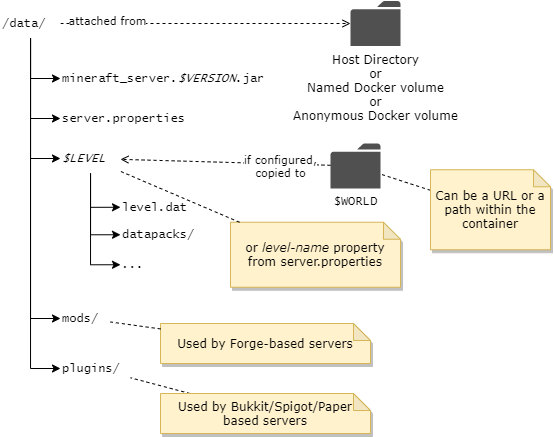

容器管理的所有内容都位于容器的`/data`路径下，如下所示：



!!! note

    容器路径`/data`已预先声明为卷，因此如果您不进行任何操作，它将被分配为一个匿名卷。因此，当容器被移除时，它也会被移除。

### 将数据目录挂载到主机文件系统

在大多数情况下，持久化和处理Minecraft数据文件的最简单方法是使用`-v`参数通过[绑定挂载](https://docs.docker.com/storage/bind-mounts/)将主机上的一个目录映射到容器的`/data`目录。在下面的示例中，路径`/home/user/minecraft-data`**必须**是主机上的一个目录：

    -v /home/user/minecraft-data:/data
       ------------------------- -----
        |                         |
        |                         +-- 必须始终是 /data
        |
        +-- 替换为主机上的一个目录

以这种方式挂载后，您可以停止服务器，编辑挂载目录下的配置，然后重新启动服务器以应用新的配置。

!!! important "无Root、Podman、SELinux、AppArmor 使用"
    当运行无Root容器（如使用Podman）或在系统上使用SELinux/AppArmor时，请在卷映射后附加`:Z`。例如：

    ```
    /home/user/minecraft-data:/data:Z
    ```

    可能有一种更安全/更好的方式来适应这些系统。如果您有更多信息，请提交Issue或PR。
    
使用Docker Compose，设置主机挂载目录更加容易，因为可以配置相对路径。例如，使用以下`docker-compose.yml`，Docker将自动创建/挂载相对目录`minecraft-data`到容器。

``` yaml title="docker-compose.yml"

services:
  mc:
    image: itzg/minecraft-server
    ports:
      - 25565:25565
    environment:
      EULA: "TRUE"
    tty: true
    stdin_open: true
    restart: unless-stopped
    volumes:
      # 挂载相对于包含此compose文件的目录的目录
      - ./minecraft-data:/data
```

### 将匿名`/data`卷转换为命名卷

如果您在第一部分中使用了命令，但没有使用`-v`卷挂载，那么Docker会创建一个匿名数据卷。您可以稍后将该内容转移到命名卷或主机挂载卷，使用以下步骤。

!!! note 

    在此示例中，假设原始容器被命名为"mc"，因此请相应地更改容器标识符。
    
    您还可以从`docker inspect <container id or name> -f "{{json .Mounts}}"`获取的`Source`字段中找到Docker管理的目录。

首先，停止现有容器：

``` shell
docker stop mc
```

使用临时容器将匿名卷的内容复制到命名卷中，本例中为"mc"：

``` shell
docker run --rm --volumes-from mc -v mc:/new alpine cp -avT /data /new
```

现在，您可以通过挂载上一步创建的命名卷来重新创建容器，并进行任何环境变量更改等：

``` shell
docker run -d -it --name mc-new -v mc:/data -p 25565:25565 -e EULA=TRUE -e MEMORY=2G itzg/minecraft-server
```

### 查找匿名卷的文件系统路径

此命令输出的`Source`字段将显示匿名卷的挂载位置：

``` shell
docker inspect -f "{{json .Mounts}}" CONTAINER_NAME_OR_ID
```

!!! note

    在Windows上使用WSL时，卷路径为`\\wsl$\docker-desktop-data\data\docker\volumes`