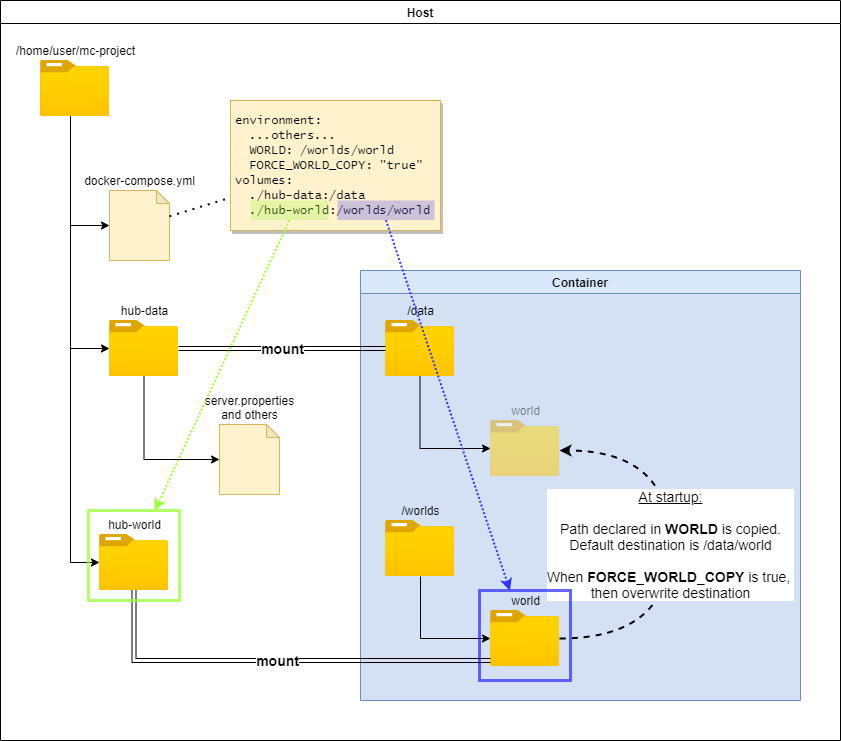

# 世界数据

## 可下载的世界

你可以指定一个包含存档世界的ZIP或压缩TAR文件的URL，而不是挂载`/data`卷。系统会搜索文件`level.dat`，并将包含该文件的子目录移动到由`$LEVEL`指定的目录中。这意味着大多数从互联网下载的Minecraft世界存档已经处于正确的格式。

    docker run -d -e WORLD=http://www.example.com/worlds/MySave.zip ...

!!! note "注意"

    该URL必须可以从容器内部访问。因此，你应该使用IP地址或全局可解析的FQDN，或者链接到一个容器的名称。

!!! note "注意"

    如果存档包含多个`level.dat`，则可以使用`WORLD_INDEX`选择要使用的文件，默认值为1。

## 从容器路径克隆世界

`WORLD`选项也可以用于引用一个目录、zip文件或压缩tar文件，这些文件将作为源来克隆或提取世界目录。

例如，以下命令将从`/worlds/basic`初始克隆世界内容。请注意，在示例中，你应该使用只读卷挂载以确保克隆源保持原始状态。

```
docker run ... -v $HOME/worlds:/worlds:ro -e WORLD=/worlds/basic
```

下图展示了如何在compose部署中使用相对目录的选项：



## 启动时覆盖世界

只有在世界不存在时才会下载或复制世界。设置`FORCE_WORLD_COPY=TRUE`以强制在每次服务器启动时覆盖世界。

## 自定义世界目录路径

要在服务器上为Multiverse插件设置自定义世界目录，你可以在jar文件后传递`--world-dir`参数。为了在容器化服务器中实现相同功能，请在命令行或docker compose yaml中设置`EXTRA_ARGS`环境变量为相同的参数字符串。例如：

```
docker run -d -e EXTRA_ARGS='--world-dir ./worlds/'
```
`--world-container`、`-W`和`--universe`是`--world-dir`的别名，也可以使用。

## 数据包

数据包的安装方式与模组/插件类似。有许多环境变量以与[模组](../mods-and-plugins/index.md)相同的方式工作：

* `DATAPACKS`：逗号分隔的zip文件URL、容器内的zip文件或容器内的目录列表
* `DATAPACKS_FILE`：容器内的文本文件，其中每行是一个zip文件URL、容器内的zip文件或容器内的目录
* `REMOVE_OLD_DATAPACKS`：如果为“true”，则删除与`REMOVE_OLD_DATAPACKS_INCLUDE`匹配但排除`REMOVE_OLD_DATAPACKS_EXCLUDE`的数据包目录中的所有内容，深度不超过`REMOVE_OLD_DATAPACKS_DEPTH`
* `REMOVE_OLD_DATAPACKS_DEPTH`：默认值为16
* `REMOVE_OLD_DATAPACKS_INCLUDE`：默认值为`*.zip`
* `REMOVE_OLD_DATAPACKS_EXCLUDE`：默认值为空

数据包将放置在`/data/$LEVEL/datapacks`中

## VanillaTweaks

[VanillaTweaks](https://vanillatweaks.net/)数据包、制作调整和资源包可以通过网站的分享代码或指定要下载和安装的包的json文件来安装。数据包和制作调整将安装到由`$LEVEL`指定的当前世界目录中。当检索到新版本的包时，旧版本将自动清理。

分享代码是哈希符号后的部分，如下所示：

```
https://vanillatweaks.net/share/#MGr52E
                                 ------
                                  |
                                  +- 分享代码 MGr52E
```

接受的参数：

- `VANILLATWEAKS_FILE`：逗号分隔的JSON VanillaTweak包文件列表，可在容器内访问
- `VANILLATWEAKS_SHARECODE`：逗号分隔的分享代码列表

预期的VanillaTweaks分享代码示例：

!!! note "注意"

    资源包、数据包和制作调整都有单独的分享代码

``` yaml
VANILLATWEAKS_SHARECODE: MGr52E,tF1zL2,LnEDwT
```

预期的VanillaTweaks文件示例：

``` yaml
VANILLATWEAKS_FILE: /config/vt-datapacks.json,/config/vt-craftingtweaks.json,/config/vt-resourcepacks.json
```

``` json title="DataPacks json"
{
  "type": "datapacks",
  "version": "1.18",
  "packs": {
    "survival": [
      "graves",
      "multiplayer sleep"
    ],
    "items": ["armored elytra"]
  }
}
```

``` json title="ResourcePacks json"
{
    "type": "resourcepacks",
    "version": "1.18",
    "packs": {
        "aesthetic": ["CherryPicking", "BlackNetherBricks", "AlternateBlockDestruction"]
    }
}
```


``` json title="CraftingTweaks Json"
{
    "type": "craftingtweaks",
    "version": "1.18",
    "packs": {
        "quality of life": [
            "dropper to dispenser",
            "double slabs",
            "back to blocks"
        ]
    }
}
```