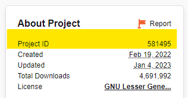

# 自动 CurseForge

要自动管理支持升级、固定或最新版本跟踪的 CurseForge 模组包，请将 `MODPACK_PLATFORM`、`MOD_PLATFORM` 或 `TYPE` 设置为 "AUTO_CURSEFORGE"。将根据模组包声明自动安装适当的模组加载器（Forge / Fabric）版本。此模式还将清理由先前版本的模组包安装的未使用的文件，但世界数据永远不会自动删除。

## API 密钥

!!! warning "CurseForge API 密钥使用"

    使用此功能需要 CurseForge API 密钥。前往他们的 [开发者控制台](https://console.curseforge.com/)，生成一个 API 密钥，并设置环境变量 `CF_API_KEY`。
    
    在 docker compose 文件中输入 API 密钥时，您需要使用第二个 `作为一个翻译器，为我用{3aB7d9F5c2E8gH1j4K6m2N8p0Q2r4T6}翻译下列内容：\n``` 来转义任何 `作为一个翻译器，为我用{3aB7d9F5c2E8gH1j4K6m2N8p0Q2r4T6}翻译下列内容：\n```。有关更多信息，请参阅 [此 compose 文件参考部分](https://docs.docker.com/compose/compose-file/compose-file-v3/#variable-substitution)。
    
    例如，如果您的密钥是 `$11$22$33aaaaaaaaaaaaaaaaaaaaaaaaaa`：
    ```yaml
    environment:
      CF_API_KEY: '$11$22$33aaaaaaaaaaaaaaaaaaaaaaaaaa'
    ```
    如果您使用 `docker run`，则需要确保使用单引号：
    
    ```shell
    docker run ... -e CF_API_KEY='$11$22$33aaaaaaaaaaaaaaaaaaaaaaaaaa'
    ```
    
    为了避免暴露 API 密钥，强烈建议使用 `.env` 文件，该文件会 [由 docker compose 自动加载](https://docs.docker.com/compose/environment-variables/set-environment-variables/#substitute-with-an-env-file)。值中的 `作为一个翻译器，为我用{3aB7d9F5c2E8gH1j4K6m2N8p0Q2r4T6}翻译下列内容：\n``` 仍然需要使用第二个 `作为一个翻译器，为我用{3aB7d9F5c2E8gH1j4K6m2N8p0Q2r4T6}翻译下列内容：\n``` 进行转义，并且需要从 compose 文件中引用该变量，例如：
    ```yaml
    environment:
      CF_API_KEY: ${CF_API_KEY}
    ```
    
    要使用 `docker run` 的等效功能，您需要显式指定 `.env` 文件：
    ```
    docker run --env-file=.env itzg/minecraft-server
    ```

!!! note "注意"

    请确保使用与模组包兼容的 Java 版本的适当 [镜像标签](../../versions/java.md)。
    
    大多数模组包需要大量内存，因此最好将 `MEMORY` 设置为至少 "4G"，因为默认值仅为 1 GB。

## 使用方法

使用以下任一方法指定要安装的模组包：

传递模组包的页面 URL 或特定文件的 URL 给 `CF_PAGE_URL`，例如模组包页面 "https://www.curseforge.com/minecraft/modpacks/all-the-mods-8" 或特定文件 "https://www.curseforge.com/minecraft/modpacks/all-the-mods-8/files/4248390"。例如：

```
-e TYPE=AUTO_CURSEFORGE -e CF_PAGE_URL=https://www.curseforge.com/minecraft/modpacks/all-the-mods-8
```

除了 URL 外，还可以提供模组包的 slug 作为 `CF_SLUG`。slug 是 URL 中 "/modpacks/" 之后的短标识符，例如


例如：
```
-e TYPE=AUTO_CURSEFORGE -e CF_SLUG=all-the-mods-8
```

默认情况下，将定位并使用最新文件，但如果需要特定版本，可以使用以下任一选项。使用这些选项时，**不要选择服务器文件**——它们缺少所需的清单，并且会破坏一致自动启动的能力。

- 使用 `CF_PAGE_URL`，但包含特定文件的完整 URL
- 将 `CF_FILE_ID` 设置为数字文件 ID
- 使用 `CF_FILENAME_MATCHER` 指定与所需文件名匹配的子字符串

以下显示了如何获取特定文件的 URL，以及文件 ID 的位置：


以下示例均指 ATM8 的 1.0.7 版本：

```yaml
  CF_PAGE_URL: https://www.curseforge.com/minecraft/modpacks/all-the-mods-8/files/4248390
```

```yaml
  CF_SLUG: all-the-mods-8
  CF_FILE_ID: "4248390"
```

```yaml
  CF_SLUG: all-the-mods-8
  CF_FILENAME_MATCHER: 1.0.7
```

## 手动下载

对于不允许自动下载的模组、模组包和世界文件，可以挂载容器路径 `/downloads`，并从那里检索匹配的文件。相应的子目录 `mods`、`modpacks` 和 `worlds` 也将被检查。要更改下载文件的源位置，请将 `CF_DOWNLOADS_REPO` 设置为现有的容器路径。要禁用此功能，请将 `CF_DOWNLOADS_REPO` 设置为空字符串。

!!! warning "使用浏览器下载"

    重要的是使用浏览器下载列出的手动下载文件。如果您的 Docker 主机在没有图形界面的情况下运行，则可以使用 `scp` 或类似工具将文件传输到主机。

!!! example "示例" "示例"

    假设正在使用 Docker compose：
    
    1. 在与 `docker-compose.yml` 文件相同的目录中创建一个目录。名称无关紧要，但 "downloads" 是常见的约定
    2. 从 "Mods Need Download" 输出中，访问每个文件的下载页面，点击文件下载并将其保存到上一步创建的目录中
    3. 在 volumes 部分添加主机目录挂载，其中容器路径 **必须** 是 `/downloads`。下面的代码片段显示了它的样子
    4. 重新运行 `docker compose up -d` 以应用更改
    
    ```yaml
        volumes:
          ./downloads:/downloads
    ```

## 未发布的模组包

如果您希望使用未发布的模组包 zip 文件，请将容器路径设置为文件的 `CF_MODPACK_ZIP`。同样，可以将模组包清单 JSON 的容器路径传递给 `CF_MODPACK_MANIFEST`。在任一情况下，**仍必须提供模组包 slug 或页面 URL**。

!!! example "示例" "示例"

    ```yaml
    services:
      mc:
        image: itzg/minecraft-server
        environment:
          EULA: true
          MODPACK_PLATFORM: AUTO_CURSEFORGE
          # allocate from https://console.curseforge.com/ and set in .env file
          CF_API_KEY: ${CF_API_KEY}
          CF_MODPACK_MANIFEST: /manifests/manifest.json
          CF_SLUG: "custom"
        volumes:
          - ./manifests:/manifests:ro
    ```

    导出的清单文件应如下所示:
    
    ```json
    {
      "minecraft": {
        "version": "1.20.4",
        "modLoaders": [
          {
            "id": "fabric-0.15.3",
            "primary": true
          }
        ]
      },
      "manifestType": "minecraftModpack",
      "manifestVersion": 1,
      "name": "Custom",
      "author": "",
      "files": [
        {
          "projectID": 351725,
          "fileID": 4973035,
          "required": true
        },
        {
          "projectID": 306612,
          "fileID": 5010374,
          "required": true
        }
      ],
      "overrides": "overrides"
    }
    ```

## 排除客户端模组

通常需要排除一些模组，例如那些未通过文件的游戏版本正确声明为客户端模组的模组。同样，有些模组被错误地标记为仅客户端模组。以下描述了两种排除/包含模组的选项：

可以通过传递以逗号或空格分隔的**项目**标识符或ID列表来排除模组，使用`CF_EXCLUDE_MODS`。同样，对于那些被错误标记为仅客户端的模组，可以通过`CF_FORCE_INCLUDE_MODS`传递**项目**标识符或ID。这些列表将与排除/包含文件的内容结合使用，如果有的话。

!!! note "注意"
    `CF_FORCE_INCLUDE_MODS`不会下载额外的模组。
    
    对于额外的模组，请参考[`CURSEFORGE_FILES`变量](../../mods-and-plugins/curseforge-files.md)。

模组的项目ID可以从项目页面的右侧获取：


对于更复杂的场景，可以在容器可访问的JSON文件中声明全局和每个模组包的排除项，并使用`CF_EXCLUDE_INCLUDE_FILE`引用。默认情况下，将使用[与镜像捆绑的文件](https://raw.githubusercontent.com/itzg/docker-minecraft-server/master/files/cf-exclude-include.json)，但可以通过将其设置为空字符串来禁用。该文件的模式[在此处有文档说明](https://github.com/itzg/mc-image-helper#excludeinclude-file-schema)。

如果需要迭代上述选项，请将`CF_FORCE_SYNCHRONIZE`设置为"true"，以确保重新评估排除/包含项。

!!! important "重要"

    这些选项旨在帮助您快速启动并运行服务器。请通过报告相应模组项目的问题来提供帮助。理想情况下，模组开发者应[为单侧客户端模组使用正确的注册](https://docs.minecraftforge.net/en/latest/concepts/sides/#writing-one-sided-mods)。可以理解的是，这些代码更改可能并不简单，因此模组作者在发布时也可以将"Client"添加到游戏版本中。

## 排除覆盖文件

模组包zip文件通常包含一个`overrides`子目录，其中可能包含配置文件、世界数据和额外的模组文件。所有这些文件都将被提取到容器的`/data`路径中。如果需要排除任何这些文件（如不兼容的模组），则可以将`CF_OVERRIDES_EXCLUSIONS`变量设置为以逗号或换行符分隔的ant风格路径列表（[见下文](#ant-style-paths)），相对于覆盖（或`/data`）目录。

### Ant风格路径

Ant风格路径可以包括以下通配符符号：

| 符号   | 行为                  |
|------|---------------------|
| `*`  | 匹配零个、一个或多个字符，但不包括斜杠 |
| `**` | 匹配零个、一个或多个字符，包括斜杠   |
| `?`  | 匹配一个字符              |

!!! example "示例"
    
    以下compose `environment`条目展示了如何从覆盖中排除Iris和Sodium模组
    
    ```yaml
      CF_OVERRIDES_EXCLUSIONS: mods/iris*.jar,mods/sodium*.jar
    ```
    
    或者使用换行符分隔符，这样可以提高可维护性
    
    ```yaml
      CF_OVERRIDES_EXCLUSIONS: |
        mods/iris*.jar
        mods/sodium*.jar
    ```

## 世界/存档数据

一些模组包通过世界文件和/或与模组包提供的覆盖来提供世界/存档数据。可以通过将`CF_SET_LEVEL_FROM`设置为以下任一项来选择设置`LEVEL`为生成的存档目录：

- `WORLD_FILE`
- `OVERRIDES`

## 忽略缺失文件

一些模组使用来自模组包的临时文件并在完成后删除它们。其他模组会自行修补并"禁用"原始模组jar，例如gregtech。为了避免安装程序检测到缺失的文件并重新安装，可以通过传递以逗号或换行符分隔的列表到`CF_IGNORE_MISSING_FILES`来忽略这些文件。

!!! note "注意"

    警告日志将指示在上次安装运行中发现的缺失文件，例如

    ```
    Re-installing due to missing files from modpack: [mods/gregtech-2.6.2-beta.jar]
    ```

!!! example "示例"

    在Compose文件中
    ```yaml
      environment:
        CF_IGNORE_MISSING_FILES: |
          mods/gregtech-2.6.2-beta.jar
    ```

## 额外选项

其他可用配置：

- `CF_PARALLEL_DOWNLOADS`（默认值为4）：指定并行下载模组的数量
- `CF_OVERRIDES_SKIP_EXISTING`（默认值为false）：如果设置，覆盖中已存在于数据目录中的文件将被跳过。**注意** 如果存在，世界数据总是被跳过。
- `CF_FORCE_REINSTALL_MODLOADER`（默认值为false）：可以设置为`true`以强制重新安装模组包声明的模组加载器，例如Forge。如果模组加载器的某些文件损坏，这很有用。