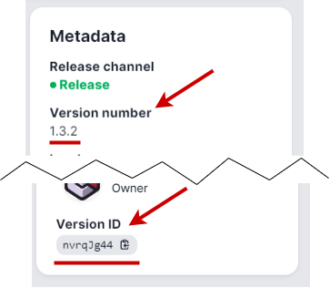

# Modrinth 模组包

通过将 `MODPACK_PLATFORM`、`MOD_PLATFORM` 或 `TYPE` 设置为 "MODRINTH"，可以自动安装 [Modrinth 模组包](https://modrinth.com/modpacks) 以及所需的模组加载器（Forge 或 Fabric）。升级（和降级）会处理旧文件的清理以及模组加载器的升级（和降级）。

## 模组包项目

所需的模组包项目通过 `MODRINTH_MODPACK` 环境变量指定，并且必须是以下之一：

- 项目 "slug"，位于此处显示的 URL 中：

  

- 项目 ID，位于左侧面板的底部，如下所示：

  

- 项目页面 URL，例如 <https://modrinth.com/modpack/cobblemon-fabric>。如下所述，这可以是模组包版本页面 URL。

- 托管的 [mrpack 文件](https://support.modrinth.com/en/articles/8802351-modrinth-modpack-format-mrpack) 的自定义 URL

- 本地 [mrpack 文件](https://support.modrinth.com/en/articles/8802351-modrinth-modpack-format-mrpack) 的容器路径

## 模组包版本

可以通过以下几种方式缩小自动模组包版本的解析范围：

当 `VERSION` 为 "LATEST" 或 "SNAPSHOT" 时，分别选择 Modrinth 模组包的最新发布版或测试版。这可以通过将 `MODRINTH_DEFAULT_VERSION_TYPE` 设置为 "release"、"beta" 或 "alpha" 来覆盖。

通过将 `VERSION` 设置为特定的 Minecraft 版本（如 "1.19.2"），可以缩小解析的模组包版本。

通过将 `MODRINTH_LOADER` 设置为 "forge"、"fabric" 或 "quilt"，可以将选定的版本缩小到特定的模组加载器。

除了自动解析外，还可以通过将版本的页面 URL 传递给 `MODRINTH_MODPACK`（例如 <https://modrinth.com/modpack/cobblemon-fabric/version/1.3.2>）或通过将 `MODRINTH_VERSION` 设置为版本 ID 或编号（位于元数据部分，如下所示）来指定特定的模组包文件版本：



## 忽略缺失文件

某些模组（如 [MCInstance Loader](https://modrinth.com/mod/mcinstance-loader)）使用来自模组包的临时文件并在完成后删除它们。为了避免安装程序检测到缺失的文件并重新安装，可以通过将逗号或换行分隔的列表传递给 `MODRINTH_IGNORE_MISSING_FILES` 来忽略这些文件。

!!! 示例

    在 Compose 文件中：
    ```yaml
      environment:
        MODRINTH_IGNORE_MISSING_FILES: |
          config/mcinstanceloader/pack.mcinstance
    ```

## 排除文件

要排除被模组包错误声明为服务器兼容的客户端模组，请将 `MODRINTH_EXCLUDE_FILES` 设置为逗号或换行分隔的部分文件名列表以排除。在迭代兼容的模组集时，可能需要将 `MODRINTH_FORCE_SYNCHRONIZE` 设置为 "true"。

!!! 示例

    在 Compose 文件中：
    ```yaml
      MODRINTH_EXCLUDE_FILES: |
        notenoughanimations
        lambdynamiclights
        euphoriapatcher
    ```

## 强制包含文件

要强制包含客户端模组，请将 `MODRINTH_FORCE_INCLUDE_FILES` 设置为逗号或换行分隔的部分文件名列表。在迭代兼容的模组集时，可能需要将 `MODRINTH_FORCE_SYNCHRONIZE` 设置为 "true"。

!!! 示例

    在 Compose 文件中：
    ```yaml
      MODRINTH_FORCE_INCLUDE_FILES: |
        yet-another-config-lib
    ```

## 默认排除/包含

该镜像附带了一组默认的排除/包含，维护在 [仓库文件区域](https://github.com/itzg/docker-minecraft-server/blob/master/files/modrinth-exclude-include.json) 中，并使用与 Auto CurseForge 相同的 [JSON 模式](https://github.com/itzg/mc-image-helper?tab=readme-ov-file#excludeinclude-file-schema)。可以通过将环境变量 `MODRINTH_DEFAULT_EXCLUDE_INCLUDES` 设置为空字符串来禁用这些默认值。

## 排除覆盖文件

Modrinth mrpack/zip 文件可能包含一个 `overrides` 子目录，其中包含配置文件、世界数据和额外的模组文件。所有这些文件都将被提取到容器的 `/data` 路径中。如果需要排除提取中的任何文件（如不兼容的模组），则可以将 `MODRINTH_OVERRIDES_EXCLUSIONS` 变量设置为逗号或换行分隔的 ant 风格路径（[见下文](#ant-style-paths)）列表以排除，相对于 overrides（或 `/data`）目录。

### Ant 风格路径

Ant 风格路径可以包括以下 globbing/通配符符号：

| 符号 | 行为                                                |
|--------|---------------------------------------------------------|
| `*`    | 匹配零个、一个或多个字符，但不包括斜杠    |
| `**`   | 匹配零个、一个或多个字符，包括斜杠 |
| `?`    | 匹配一个字符                                   |

!!! 示例

    以下 compose `environment` 条目展示了如何从 overrides 中排除 Iris 和 Sodium 模组：
    
    ```yaml
      MODRINTH_OVERRIDES_EXCLUSIONS: mods/NekosEnchantedBooks-*.jar,mods/citresewn-*.jar
    ```
    
    或使用换行分隔符，以提高可维护性：
    
    ```yaml
      MODRINTH_OVERRIDES_EXCLUSIONS: |
        mods/NekosEnchantedBooks-*.jar
        mods/citresewn-*.jar
    ```
